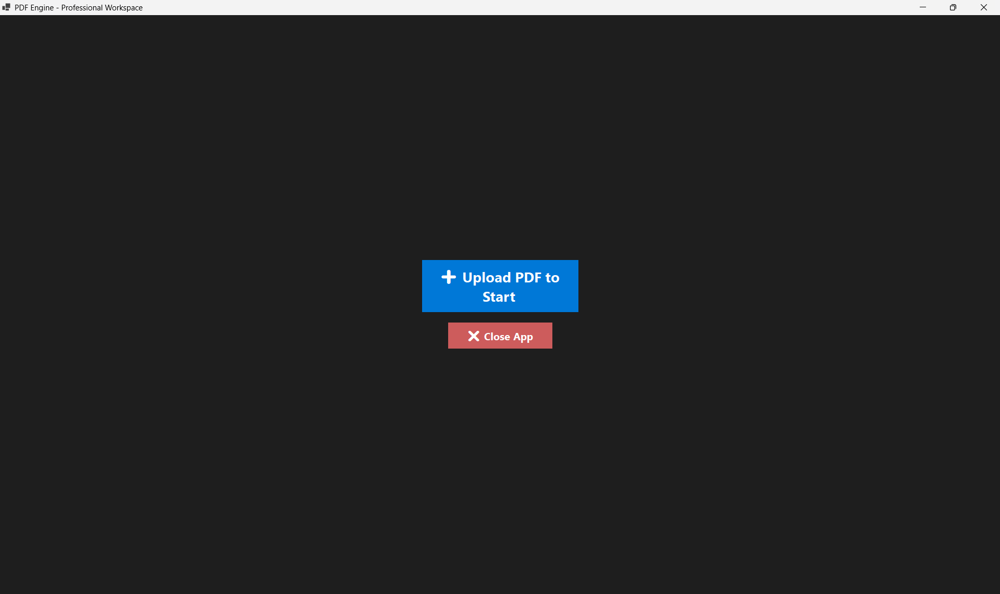
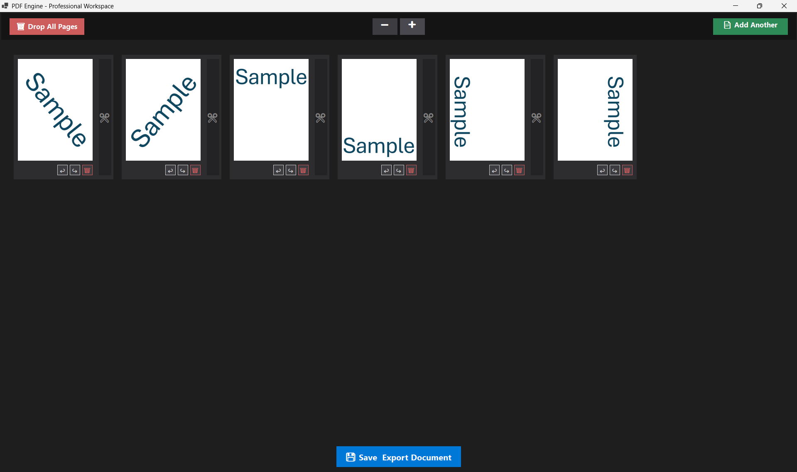

# 📄 PDF Engine


PDF Engine is a fast, desktop-native visual workspace for manipulating PDF documents. It allows you to visually merge, split, rotate, and reorder pages using a highly responsive drag-and-drop storyboard interface without permanently altering your original files until you are ready to export.


*The clean, centered launch menu to begin your workspace session.*

## ✨ Core Features

* **Visual Storyboard:** View your entire document as a grid of interactive cards.
* **Spatial Drag & Drop:** Seamlessly reorder pages across rows and columns.
* **The "Scissors" Tool:** Drop visual cut markers between pages to split a single document into multiple distinct PDF files in one click.
* **Instant Merging:** Append new PDFs to your current workspace instantly.
* **Per-Page Controls:** Rotate specific pages or delete them entirely from the final export.
* **Dynamic Zoom:** Scale the workspace in and out for a bird's-eye view of massive documents.


*A fresh PDF loaded into the engine, ready to be manipulated.*

---

## 🏗️ How It Works: "Painter vs. Mechanic"

To ensure maximum performance and prevent UI freezing when handling massive PDF files, this application divides responsibilities into two distinct engines:

1. **The UI Renderer ("The Painter"):** Powered by `PdfiumViewer`. The app rapidly rasterizes "photographs" of each page for the UI. You are manipulating lightweight images in memory, allowing for lag-free Drag & Drop and instant visual rotations.
2. **The Core Logic ("The Mechanic"):** Powered by `PdfSharp`. The original PDF file is never altered during the session (Non-Destructive Editing). When you click **Save & Export**, the backend reads your visual layout, opens the original files asynchronously, and rapidly outputs the brand-new assembled PDFs.


*The workspace in action: zoomed out, multiple files merged, pages rotated, and a cut marker placed to split the export.*

---

## 🚀 Getting Started

### Prerequisites
* [.NET 10.0 SDK](https://dotnet.microsoft.com/download/dotnet/10.0) or newer.

### Installation & Run
Copy and paste this single block into your terminal to clone the repository, navigate to the UI project, and launch the application:

```bash
git clone [https://github.com/frisko2305/Engine_your_PDFs.git](https://github.com/frisko2305/Engine_your_PDFs.git)
cd Engine_your_PDFs/PDF_Engine.WinForms
dotnet run

The final background execution: perfectly sliced and merged PDFs delivered to your directory.

Developed by Frisko2305.